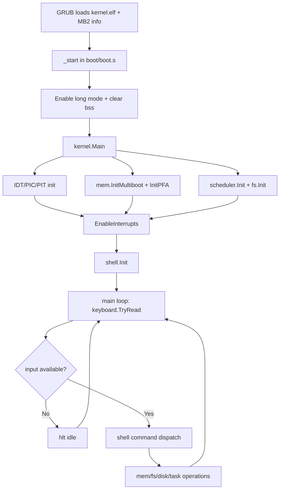
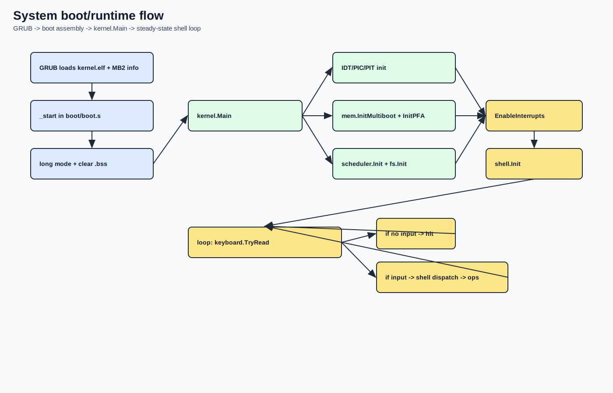
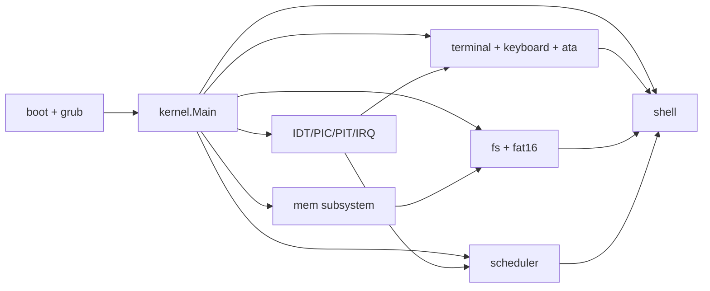
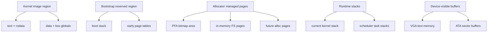

# System Architecture

## Why this page matters

This page is the high-level map of the whole project.
Before diving into single subsystems, use this chapter to understand:

- which component owns what
- how control moves from boot to runtime
- how data flows between kernel core, I/O, memory, and storage

## Scope and architecture style

`go-dav-os` is a monolithic educational kernel with small, explicit modules.

Architecture characteristics:

- single address space
- single-core execution model
- low-level x86_64 boot path in assembly
- kernel logic in Go (`gccgo`, freestanding)
- static/simple data structures over dynamic complexity

## Source anchors (quick references)

- Boot handoff to kernel: `boot/boot.s` + `kernel/kernel.go:27` to `kernel/kernel.go:64`
- Interrupt/scheduling core: `kernel/idt.go`, `kernel/irq.go`, `kernel/scheduler/scheduler.go`
- Memory discovery and allocation: `mem/multiboot.go`, `mem/allocator.go`
- I/O path: `terminal/terminal.go`, `keyboard/irq.go`, `drivers/ata/ata.go`
- Filesystem layer: `fs/fs.go`, `fs/fat16/fat16.go`
- Command interface: `shell/shell.go`

## Architectural layers

1. Boot and CPU mode transition
- GRUB loads ELF and passes Multiboot2 info.
- Boot assembly builds minimal paging and enters long mode.

2. Kernel core control plane
- Main init sequence (`kernel.Main`).
- IDT/PIC/PIT setup.
- IRQ dispatch and syscall dispatch.
- Scheduler context switch policy.

3. Resource services
- Physical memory map + page allocator.
- In-memory filesystem and persistent FAT16.

4. Device and interaction edge
- VGA terminal output.
- Keyboard input via IRQ.
- ATA PIO block device I/O.
- Shell command loop as operator interface.

## End-to-end boot/runtime flow (Mermaid)

Rendered image:

## Component dependency map (Mermaid)

Rendered image:

## Memory ownership map (conceptual)

This is not an exact address map; it is an ownership map of major runtime regions.

Rendered image:

## Data flows that matter operationally

1. Input path
- keyboard IRQ -> keyboard ring buffer -> kernel loop -> shell parser

2. Output path
- shell/kernel prints -> terminal driver -> VGA memory (+ debug port)

3. Storage path
- shell command -> FAT16/in-memory fs -> ATA PIO (for persistent path)

4. Scheduling path
- PIT IRQ0 -> scheduler decision -> context switch (`asm/switch.s`)

## Architecture constraints and tradeoffs

Current design intentionally favors clarity over feature breadth.

- No user/kernel virtual address split
- No SMP support
- Minimal syscall surface
- Legacy PIC/PIT path (didactic and simple)
- Static-size pools and arrays for predictability

This makes behavior easier to reason about while learning core OS internals.

## Where to continue

Recommended next pages:

1. `docs/manual/02-boot/boot-and-grub.md`
2. `docs/manual/02-boot/linker-and-initial-memory-layout.md`
3. `docs/manual/03-kernel-core/main-loop.md`
