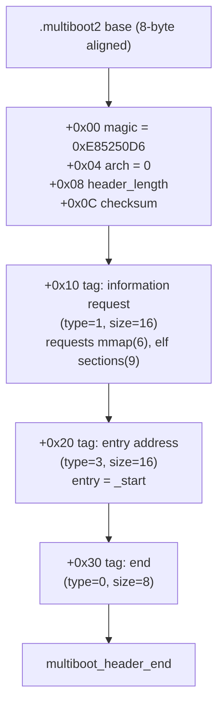
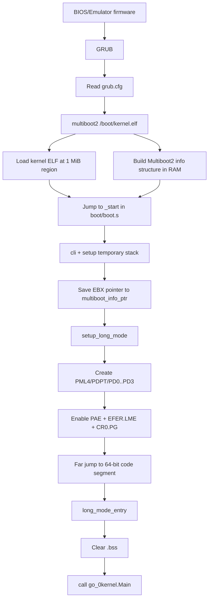
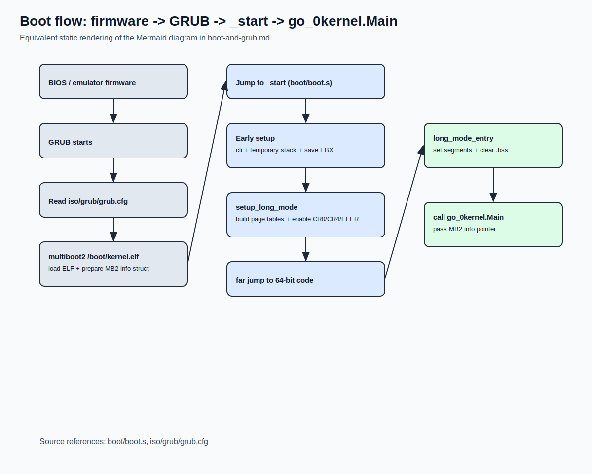

# Boot and GRUB

## Why this chapter matters

Boot is the boundary between firmware/bootloader world and your kernel world.
If you understand this handoff, the rest of the kernel becomes much easier to reason about.

## What GRUB does (manual-level view)

At a high level, GRUB is responsible for three things:

1. Loading your kernel image (`kernel.elf`) from disk
2. Preparing boot metadata (especially the Multiboot2 info structure)
3. Jumping to your kernel entry point with a defined calling contract

In this project, GRUB is configured by `iso/grub/grub.cfg`:

```cfg
menuentry "dav-go-os" {
    multiboot2 /boot/kernel.elf
    boot
}
```

The `multiboot2` command tells GRUB to treat the kernel as a Multiboot2 kernel.

## What GRUB expects from a Multiboot2 kernel

For GRUB to accept and boot a kernel, the image must include a valid Multiboot2 header.
Here's the [Multiboot2 specification](https://www.gnu.org/software/grub/manual/multiboot2/multiboot.html).

### Required header constraints

- Header must be 8-byte aligned
- Header must be located within the first 32 KiB of the kernel image
- Header must contain:
  - magic (`0xE85250D6`)
  - architecture (`0` for i386 protected-mode entry)
  - header length
  - checksum so the 32-bit sum is zero

### How this is implemented in our code

In `boot/boot.s` (see `boot/boot.s:22` through `boot/boot.s:53`):

- `.section .multiboot2`
- `multiboot_header_start` / `multiboot_header_end`
- header magic/arch/length/checksum fields
- end tag (`type=0`, `size=8`)

We also add two useful tags:

- Information request tag (asks for memory map and ELF sections)
- Entry address tag (explicit `_start`)

### Graphical example: how `.multiboot2` is laid out in memory

This is a conceptual in-memory layout of the header block loaded by GRUB.
The exact base address can vary, but this block is inside the first 32 KiB of the kernel image.



Rendered image:


Runtime meaning:

- GRUB scans this structure to validate that the image is a Multiboot2 kernel.
- If valid, GRUB loads the ELF, builds the Multiboot2 info structure, and jumps to `_start`.


## What GRUB passes at kernel entry

When GRUB transfers control to `_start`, the kernel gets:

- `EAX = 0x36D76289` (Multiboot2 bootloader magic)
- `EBX = physical address of Multiboot2 info structure`

Our `_start` does this immediately:

1. `cli` (disable interrupts)
2. set `ESP` to `stack_top`
3. copy `EBX` into `multiboot_info_ptr`
4. call `setup_long_mode`

So the Multiboot2 pointer is preserved and later forwarded to Go (`kernel.Main`).

## What the Multiboot2 info structure looks like

The structure pointed by `EBX` is a tag list in memory:

- starts with:
  - `total_size` (u32)
  - `reserved` (u32)
- followed by variable-size tags
- each tag is 8-byte aligned
- terminated by end tag (`type=0`)

Our memory module (`mem/multiboot.go`) scans this structure and reads tag `type=6` (memory map).

## What we put in memory (our side)

GRUB loads the ELF, but the internal layout is decided by `boot/linker.ld`.

### Linker placement policy

- Kernel load base: `1 MiB` (`. = 1M`)
- Section order:
  - `.text` (includes `.multiboot2` and code)
  - `.rodata`
  - `.data`
  - `.bss`
  - `.bootstrap_stack`
- Exported symbols:
  - `__bss_start`, `__bss_end`
  - `__bootstrap_end`
  - `__kernel_end`

### Bootstrap-specific memory we allocate

In `boot/boot.s`, inside `.bootstrap_stack`:

- 16 KiB boot stack (`stack_bottom..stack_top`)
- Page tables for early long mode:
  - `pml4` (4 KiB)
  - `pdpt` (4 KiB)
  - `pd0`, `pd1`, `pd2`, `pd3` (4 x 4 KiB)
- scratch `multiboot_info_ptr` (stores the pointer from `EBX`)

## Visual boot flow (Mermaid)



Rendered image:



## Visual memory map (physical)

The exact end addresses depend on build size, but the structure is:

```text
Low physical memory
0x00000000  -------------------------------------------------
            | BIOS/legacy areas, low memory, IVT, etc.      |
            | (not managed by our boot code directly)        |
0x00100000  -------------------------------------------------  <- linker base (1 MiB)
            | .text                                           |
            |   - Multiboot2 header (.multiboot2)            |
            |   - _start and setup_long_mode code            |
            | .rodata (includes gdt64/gdt64_desc)            |
            | .data                                           |
            | .bss (cleared in long_mode_entry)              |
            | .bootstrap_stack                                |
            |   - 16 KiB stack                               |
            |   - pml4/pdpt/pd0..pd3                         |
            |   - multiboot_info_ptr                         |
__kernel_end -------------------------------------------------  <- end of kernel image region
            | free/usable RAM (depends on Multiboot map)     |
            | ...                                             |
            | Multiboot2 info structure (address in EBX)     |
            |   location chosen by GRUB                      |
High memory  -------------------------------------------------
```

## Visual map of early paging

In `setup_long_mode`, we build identity mapping for the first 4 GiB with 2 MiB pages:

```text
Virtual address                Physical address
0x00000000 - 0xFFFFFFFF   ->   0x00000000 - 0xFFFFFFFF   (via pd0+pd1+pd2+pd3)

PML4[0] -> PDPT
PDPT[0] -> PD0  (maps first 1 GiB)
PDPT[1] -> PD1  (maps second 1 GiB)
PDPT[2] -> PD2  (maps third 1 GiB)
PDPT[3] -> PD3  (maps fourth 1 GiB)

Each PD entry maps one 2 MiB page (PS bit set).
```

This is why early code can still access low physical addresses directly after switching to long mode.

## Step-by-step: GRUB contract vs our implementation

| Boot contract item | Required by GRUB/Multiboot2 | Our implementation |
| --- | --- | --- |
| Multiboot2 header in first 32 KiB | Yes | `.multiboot2` section in `boot/boot.s`, included early in `.text` |
| 8-byte alignment | Yes | `.align 8` around header/tags |
| Valid checksum | Yes | computed in header definition |
| Entry point | Needed | `_start` + entry-address tag |
| Boot info pointer | `EBX` | saved to `multiboot_info_ptr`, later passed to Go |
| Switch to 64-bit mode | Kernel responsibility | `setup_long_mode` in `boot/boot.s` |
| Clean `.bss` before high-level runtime | Kernel responsibility | `rep stosb` in `long_mode_entry` |
| Call language runtime/kernel main | Kernel responsibility | `call go_0kernel.Main` |

## Where to continue

After this chapter, continue with:

- `docs/manual/02-boot/linker-and-initial-memory-layout.md`

That page focuses on linker symbols and why memory allocator safety depends on them.
