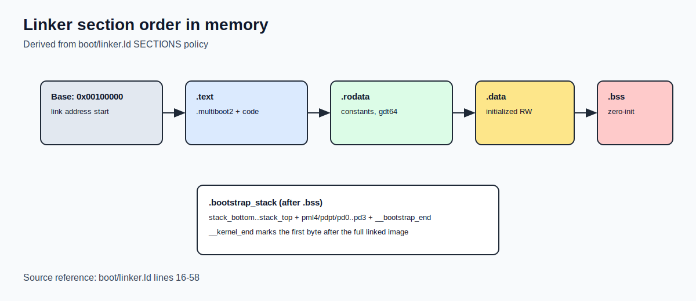
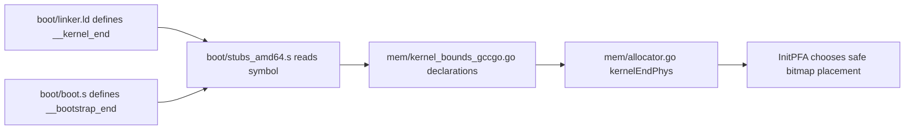
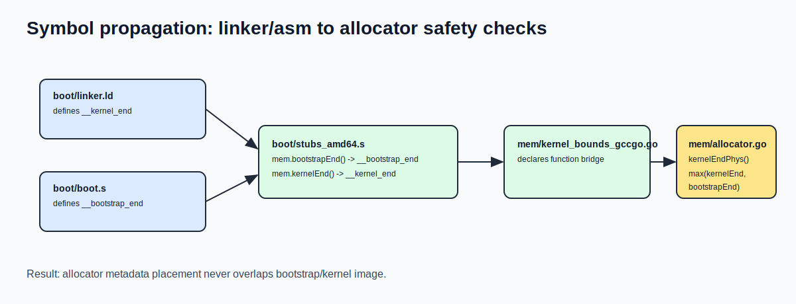

# Linker and Initial Memory Layout

## Why this chapter matters

GRUB loads your kernel image, but the linker script decides how that image is organized in memory.
This file is the contract between build-time layout and runtime assumptions.

## Linker vs loader: clear responsibility split

- Loader (GRUB): reads ELF from disk and places loadable segments in RAM
- Linker (`ld` via `boot/linker.ld`): defines section order, addresses, alignment, and exported symbols

If the linker layout is wrong, early boot code can fail even when GRUB is working correctly.

## Source anchors (exact code references)

Use these anchors while reading:

- Linker declarations and section policy: `boot/linker.ld:11` to `boot/linker.ld:58`
- `.bss` clear at runtime: `boot/boot.s:258` to `boot/boot.s:263`
- Symbol bridge assembly stubs:
  - `boot/stubs_amd64.s:60` to `boot/stubs_amd64.s:66` (`__bootstrap_end`)
  - `boot/stubs_amd64.s:68` to `boot/stubs_amd64.s:74` (`__kernel_end`)
- Go declarations for linker bounds: `mem/kernel_bounds_gccgo.go:5` to `mem/kernel_bounds_gccgo.go:6`
- Allocator safety check: `mem/allocator.go:16` to `mem/allocator.go:23`

## Our linker script at a glance

Key file:

- `boot/linker.ld`

Core declarations:

- `OUTPUT_FORMAT("elf64-x86-64")`
- `OUTPUT_ARCH(i386:x86-64)`
- `ENTRY(_start)`

This means:

- 64-bit ELF output
- x86_64 target architecture
- entry symbol is `_start` (implemented in `boot/boot.s`)

## Runtime placement policy in `SECTIONS`

`SECTIONS` starts with:

- `. = 1M;`

So the kernel image is linked to begin at physical address `0x00100000`.

Then sections are laid out in this order, each page-aligned (`BLOCK(4K)` + `ALIGN(4K)`):

1. `.text`
2. `.rodata`
3. `.data`
4. `.bss`
5. `.bootstrap_stack`

Important detail: `.text` includes both:

- `*(.multiboot2)`
- `*(.text)`

This helps keep the Multiboot2 header near the beginning of the image, where GRUB can find it.

## What this means in practice (manual-level)

When GRUB loads your ELF, it does not "invent" a memory layout for your internals.
It maps loadable segments according to the ELF produced by your linker script.

So if you change section order/alignment in `boot/linker.ld`, you are changing the runtime memory map your boot code relies on.

## Exported symbols and who uses them

### `__bss_start`, `__bss_end`

Defined inside `.bss` section (`boot/linker.ld:45`, `boot/linker.ld:48`).
Used in `boot/boot.s` (`long_mode_entry`) to clear zero-initialized memory:

- `movq $__bss_start, %rdi`
- `movq $__bss_end, %rcx`
- `rep stosb`

### `__bootstrap_end`

Defined in `boot/boot.s` right after bootstrap stack/page-table structures.
Read by the bridge stub in `boot/stubs_amd64.s:60` to `boot/stubs_amd64.s:66` and exposed as `mem.bootstrapEnd()`.

### `__kernel_end`

Defined in `boot/linker.ld:57` at the end of linked kernel image.
Read by the bridge stub in `boot/stubs_amd64.s:68` to `boot/stubs_amd64.s:74` and exposed as `mem.kernelEnd()`.

### Why `kernelEnd` and `bootstrapEnd` are both needed

In `mem/allocator.go`, `kernelEndPhys()` chooses the max of:

- `kernelEnd()`
- `bootstrapEnd()`

This is a safety guard: allocator metadata must never overlap kernel/boot data.

## Why `.bootstrap_stack` is outside `.bss`

The bootstrap area stores runtime-critical early objects:

- 16 KiB stack (`stack_bottom..stack_top`)
- page tables (`pml4`, `pdpt`, `pd0..pd3`)

If these lived inside `.bss`, generic `.bss` clearing logic could wipe them at the wrong time.
Keeping them in a dedicated section prevents accidental zeroing during runtime initialization.

## Visual layout (Mermaid)

```mermaid
flowchart TB
    A[Link address base: 0x00100000] --> B[.text\n(.multiboot2 + code)]
    B --> C[.rodata\nconstants, gdt64]
    C --> D[.data\ninitialized writable data]
    D --> E[.bss\nzero-initialized globals\n__bss_start/__bss_end]
    E --> F[.bootstrap_stack\nstack + early page tables\n... __bootstrap_end]
    F --> G[__kernel_end]
```

Rendered image:



## Visual flow of symbol propagation (Mermaid)



Rendered image:



## Visual layout (address-oriented)

```text
0x00100000  -----------------------------------------------
            | .text                                        |
            |   includes .multiboot2 header               |
            |   includes _start and boot code             |
            -----------------------------------------------
            | .rodata                                     |
            -----------------------------------------------
            | .data                                       |
            -----------------------------------------------
            | .bss                                        |
__bss_start -> first byte of .bss                         |
__bss_end   -> first byte after .bss                      |
            -----------------------------------------------
            | .bootstrap_stack                            |
            |   stack_bottom..stack_top                   |
            |   pml4/pdpt/pd0/pd1/pd2/pd3                |
__bootstrap_end -> first byte after bootstrap structures   |
            -----------------------------------------------
__kernel_end -> first byte after linked kernel image
```

## Build-time contract vs runtime behavior

| Linker rule | Why it exists | Runtime dependency |
| --- | --- | --- |
| `ENTRY(_start)` | Define real execution entry | GRUB jumps into `_start` |
| `. = 1M` | Known physical base | boot code and diagrams assume low fixed base |
| `.text` starts with `.multiboot2` | Keep header discoverable | GRUB recognizes image as Multiboot2 |
| 4 KiB alignment | Page-friendly layout | simplifies paging/allocator assumptions |
| `.bss` symbol bounds | precise clear range | `long_mode_entry` zeroes exactly `.bss` |
| `.bootstrap_stack` separate section | protect early structures | avoids accidental clobbering of stack/page tables |
| `__kernel_end` export | mark reserved image end | allocator avoids kernel overwrite |

## Related source files to read next

- `boot/boot.s` for `_start`, long mode switch, and `.bss` clear
- `mem/allocator.go` for how linker symbols protect allocator placement
- `mem/kernel_bounds_gccgo.go` + `boot/stubs_amd64.s` for symbol bridge into Go
