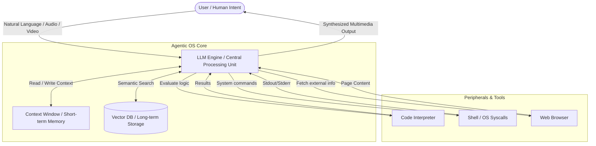
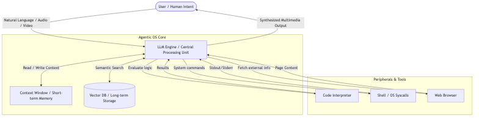
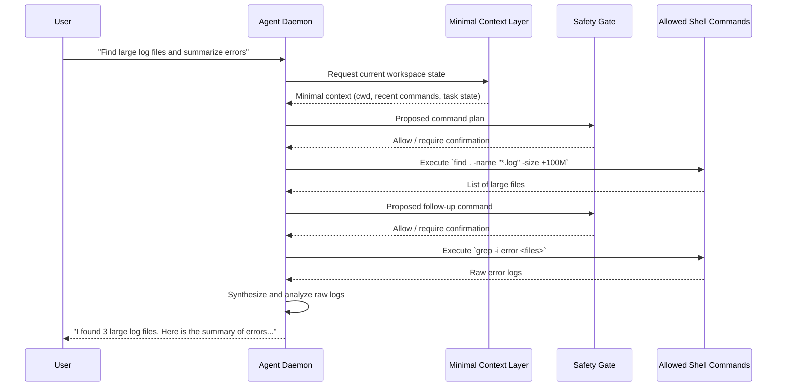
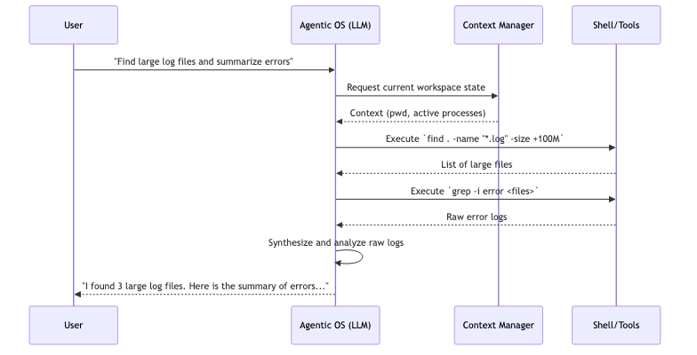
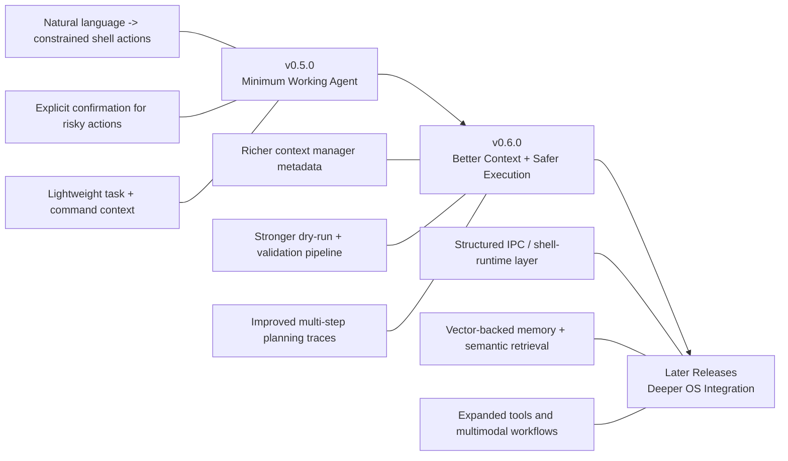

# Agentic OS (LLM OS) Architecture Concept

## Overview
As proposed in [Issue #102](https://github.com/dmarro89/go-dav-os/issues/102), the vision for v0.5.0 and beyond is to explore the concept of an "Agentic OS." In an Agentic OS, the user interacts with the operating system through an open conversation, using natural language to express intent rather than formulating rigid terminal commands. The OS Agent leverages contextual awareness of existing commands to execute tasks and provide structured, human-readable outputs.

This concept is heavily inspired by Andrej Karpathy's "LLM OS" vision, which reimagines the traditional operating system architecture by positioning a Large Language Model (LLM) at the core, serving as the central orchestrator (CPU).

This document describes the target architecture and an incremental path toward it. The diagrams below represent the long-term direction, not the exact feature set already available in `go-dav-os` v0.4.0.

## Architectural Paradigm Shift
Traditional operating systems are deterministic, relying on strict code execution paths. The Agentic OS introduces a probabilistic paradigm, where execution is driven by language understanding, reasoning, and inference. This makes the OS highly flexible, allowing it to interpret ambiguous user requests and plan complex, multi-step actions autonomously.

### System Architecture Diagram

### Core Components Analogy
In the LLM OS model, traditional hardware and software abstractions are mapped to AI-driven equivalents:

*   **CPU (Central Processing Unit) -> The LLM Engine**
    The core logic engine is the Large Language Model itself (e.g., GPT-4, Llama). It interprets natural language instructions, acts as a task planner, orchestrates interactions between components, and generates final responses.
    
*   **RAM (Random Access Memory) -> Context Window**
    The LLM's context window acts as the active memory. It holds the current conversation history, immediate instructions, and relevant system state required for the active processing cycle.
    
*   **File System (Storage) -> Vector Databases / Embeddings**
    Long-term memory and the file system are managed via vector databases. System documentation, user files, and historical interactions are stored as embeddings (e.g., Ada-002), allowing the LLM to search and retrieve relevant data using semantic similarity.
    
*   **Peripherals & Userland -> Agentic Tools**
    The OS is equipped with tools that the LLM can invoke to perform concrete actions. These include:
    *   **Shell/Terminal Execution:** To run underlying system commands safely.
    *   **Code Interpreter:** To write and execute scripts dynamically.
    *   **Web Browser:** To fetch external information.
    *   **Calculators/APIs:** For deterministic computations.
    
*   **I/O (Input/Output) -> Multimodal Interfaces**
    Sensory inputs (audio, video, text) and outputs replace traditional keyboards and monitors. The user can speak to the OS, provide images, and receive rich, multimodal feedback.

## User Experience (UX) & Execution Flow
The primary interaction model shifts from a Command Line Interface (CLI) or Graphical User Interface (GUI) to a **Conversational User Interface (CUI)**. 
- **Intent vs. Command:** The user states what they want to achieve (e.g., "Find all large log files and summarize the errors"), and the Agentic OS determines the necessary steps (`find`, `grep`, `awk`), executes them invisibly, and presents the final summary.
- **Contextual Awareness:** The OS maintains the context of the user's workspace, knowing which files are open, what the previous commands were, and what the user's overall goals are.

### Workflow Sequence Diagram (v0.5.0 Minimum Working Agent)

## Implementation Architecture for Go-Dav-OS
For `go-dav-os` v0.5.0 and beyond, the Agentic OS vision can be approached through a modular architecture that gradually bridges the Go kernel and the AI agent:

1.  **Agent Daemon (User-mode Process):** 
    Introduce an initial AI agent daemon running as a user-mode task. In its first iteration, this daemon can focus on intent parsing, basic task orchestration, and invoking a constrained set of existing shell capabilities.
    
2.  **Syscall / Shell Interception:** 
    In later iterations, the agent will require a mechanism to securely invoke internal OS APIs and shell built-ins. Because `go-dav-os` does not currently provide an IPC layer for this, the first versions should rely on simpler command mediation before evolving toward direct structured communication with the shell runtime.
    
3.  **Context Management Subsystem:** 
    Develop a lightweight context aggregator that captures a minimal but useful view of system state, then expand it over time. Early versions can expose only stable essentials such as the current working context, active task metadata, and command history before growing toward richer runtime information.
    
4.  **Vector Storage (VFS Extension):** 
    Integrate vector search as a later-stage VFS extension. This would allow files and past commands to be indexed locally using embeddings, enabling the LLM to search for files by intent rather than exact paths once the base agent flow is stable.

5.  **Security, Sandboxing & Permissions:** 
    Because LLMs are probabilistic and prone to hallucinations, commands generated by the LLM must be sandboxed.
    *   **Dry-run execution:** The LLM proposes commands which are evaluated for safety before execution.
    *   **Privilege boundaries:** The agent should run with least privilege, prompting the user via the UI for permission before performing destructive operations (e.g., `rm`, writing over system files).

## Iterative Delivery Approach
To keep the vision aligned with the current maturity of `go-dav-os`, it is useful to define an incremental roadmap instead of targeting the full Agentic OS model in a single release.

### Iterative Roadmap Diagram

### v0.5.0: Minimum Working Agent
The first step can be a minimal agent that proves the interaction model without requiring every long-term subsystem:

*   Accept natural-language input and translate it into a small, predefined set of shell actions.
*   Operate with a constrained command surface and explicit user confirmation for risky actions.
*   Maintain lightweight conversational context such as the current task, recent commands, and recent outputs.
*   Return structured, human-readable responses instead of raw shell output whenever possible.

This stage establishes the user experience of a conversational operating system while staying compatible with the primitive state of the current OS.

### v0.6.0: Better Context and Safer Execution
Once the minimal agent exists, the next release can improve the quality and safety of orchestration:

*   Expand the context manager with richer system metadata.
*   Improve command validation, dry-run inspection, and permission gating.
*   Add better planning for multi-step tasks and clearer execution traces for the user.

### Later Releases: Deeper OS Integration
After the basic agent loop is reliable, later versions can move toward the full Agentic OS target:

*   Introduce a dedicated IPC or structured shell-runtime communication layer.
*   Add vector-backed memory and semantic file retrieval.
*   Explore multimodal inputs, richer tools, and deeper kernel-aware integrations.

With this iterative approach, each release delivers a usable step forward while preserving the long-term architectural direction described in this document.
